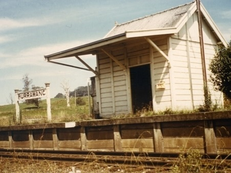

# Burrawang

**Burrawang**, is the closed station in Burrawang, and served by [Southern Highlands Line](/sydneyrail/train/sh) before, now its served by coach.

## Services

| Line | Previous | Next |
| :--- | :--- | :--- |
| <mark style="background-color: #00954C; display: inline-block; padding: 6px 10px; margin: -6px -10px;"><a href="/sydneyrail/metro/m1" style="color: #fff;">SH</a><small>(Coach)</small></mark> | [Bowral](/sydneyrail/bowral/bowral) | [Robertson](/sydneyrail/robertson/robertson) |

## Platforms

| Platform | Image |
| :--- | :--- |
| 1 |  |
