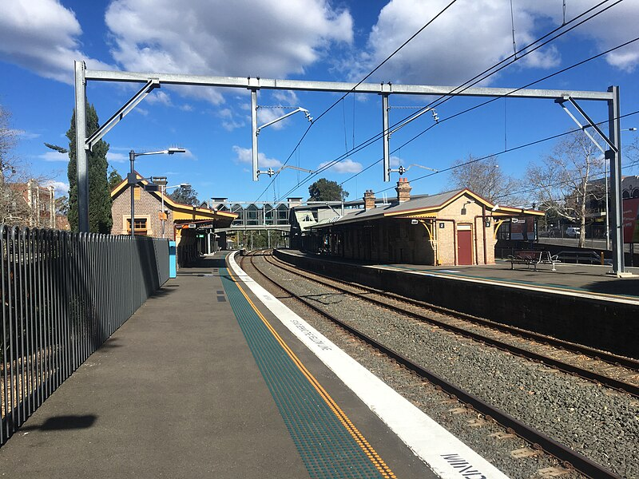

# Lindfield

**Lindfield**, is the station in Lindfield, and served by [North Shore & Western Line](/train/t1), [Northern Line](/train/t9), and [Central Coast & Newcastle Line](/train/ccn), this station can be the terminus station of [North Shore & Western Line](/train/t1).

## Services

| Line | Previous | Next |
| :--- | :--- | :--- |
| <mark style="background-color: #F99D1C; display: inline-block; padding: 6px 10px; margin: -6px -10px;"><a href="/train/t1" style="color: #fff;">T1</a></mark> | [Killara](/killara/killara) | [Roseville](/roseville/roseville) |
| <mark style="background-color: #D11F2F; display: inline-block; padding: 6px 10px; margin: -6px -10px;"><a href="/train/t9" style="color: #fff;">T9</a></mark> | [Killara](/killara/killara) | [Roseville](/roseville/roseville) |
| <mark style="background-color: #D11F2F; display: inline-block; padding: 6px 10px; margin: -6px -10px;"><a href="/train/ccn" style="color: #fff;">CCN</a></mark> | [Gordon](/gordon/gordon) | [Chatswood](/chatswood/chatswood) |

## Platforms

| Platform | Image |
| :--- | :--- |
| 1 |  |
| 2 |  |
| 3 |  |