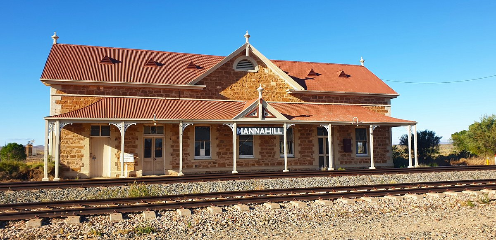

# Mannahill
**Mannahill**, is the closed station in Mannahill, South Australia, and served by Cockburn Line (Now [Western Region](/train/wst)).

## Services

| Line | Previous | Next |
| :--- | :--- | :--- |
| <mark style="background-color: #F6891F; display: inline-block; padding: 8px 12px; margin: -8px -12px;"><a href="/train/wst" style="color: #fff;">WST</a></mark> | [Outalpa](/outalpa/outalpa) | [Oulnina](/oulnina/oulnina) |
## Platforms

| Platform | Image |
| --- | --- |
| 1 |  |