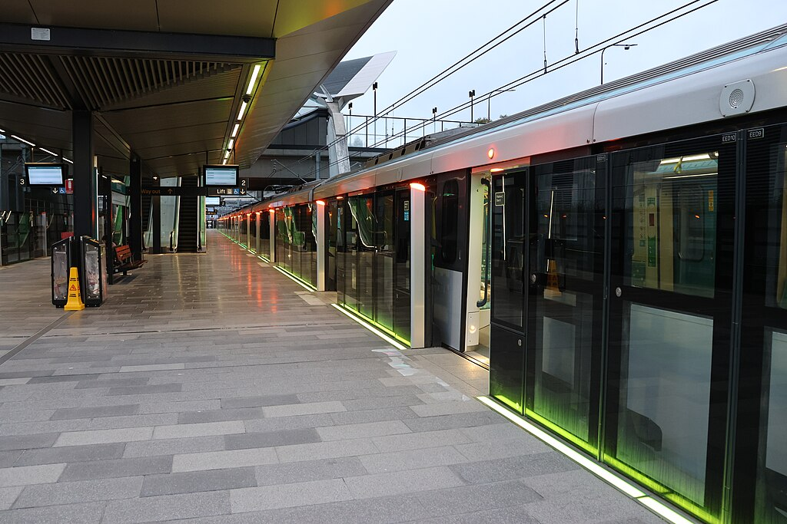
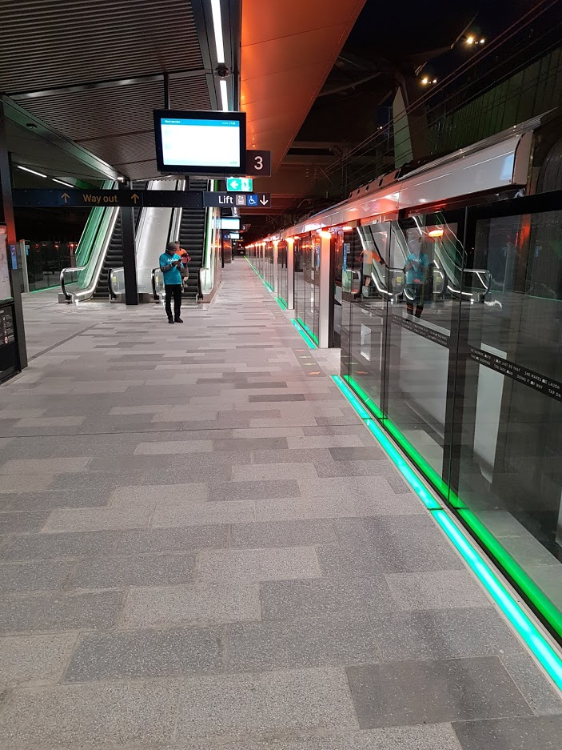

# Tallawong

**Tallawong** (used **Cudgegong Road** under construction), is the station in Rouse Hill, instead of Tallawong, suburb of Tallawong was established later than the station, and served by [Metro North West & Bankstown Line](/metro/m1), future were extented to Schofields from here.

## Services

| Line | Previous | Next |
| :--- | :--- | :--- |
| <mark style="background-color: #168388"><a href="/metro/m1" style="color: #fff;">M1</a></mark> | <em>[Schofields](/schofields/schofields) (Future extension)</em> | [Rouse Hill](/rousehill/rousehill) |

## Maps

| Type | Valid Year |
| --- | --- | --- |
| [Bus Guide](CUD_APXP_BSG_WCAG_20250119.pdf) | 2025 |
| [Station Guide](CUD_APCP_001.pdf) | 2024 |
| [Bus Guide](CUD_APCP_007.pdf) | 2021 |
| [Bus Guide](CUD_APCP_007(old).pdf) | 2020 |

## Platforms

| Platform | Image |
| --- | --- |
| 2 |  |
| 3 |  |